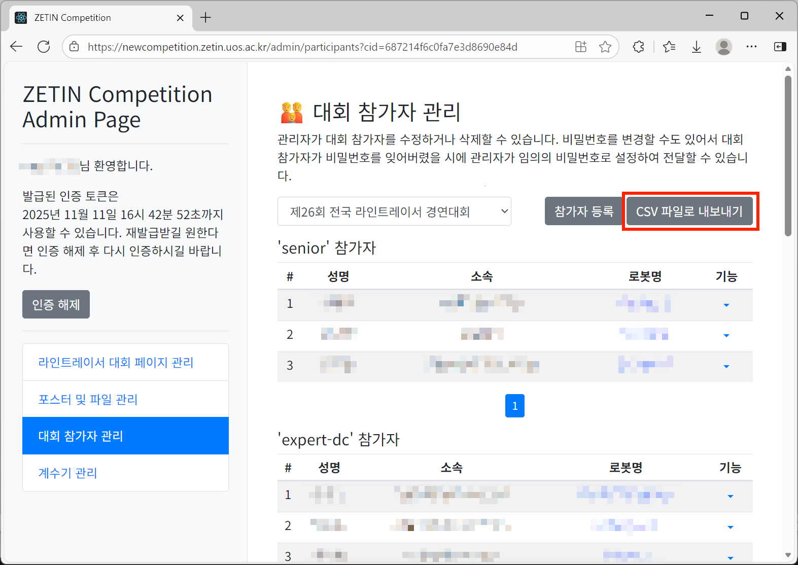
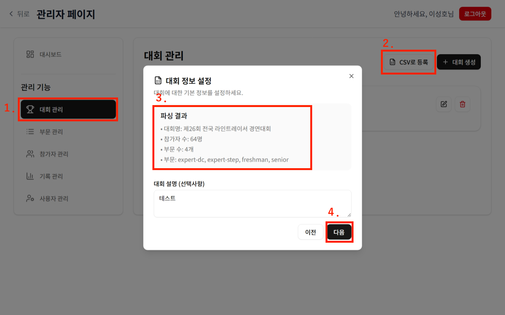

# 대회 생성 및 부문/참가자 일괄 등록하기

웹 인터페이스로 대회 생성, 부문 생성, 참가자 등록을 한번에 할 수 있는 기능을 제공합니다. 이름, 소속, 로봇 이름, 참가 순번, 참가 부문, 대회 이름를 헤더로 가지는 CSV 파일을 받을 수 있습니다.

## CSV 파일 준비하기

- CSV 파일은 꼭 아래와 일치하는 컬럼을 모두 보유해야 합니다.
  - `이름`
  - `소속`
  - `로봇 이름`
  - `참가 순번`
  - `참가 부문`
  - `대회 이름`
- **※ TIP - 대회 신청 관리자 페이지에서 다운로드하면 위의 컬럼을 보유한 CSV를 다운로드 받을 수 있습니다.**
  

## 일괄 등록하기

1. [계수기 서비스](https://counter.zetin.uos.ac.kr)에 로그인합니다.
1. '관리자 페이지 이동' 버튼을 누릅니다.
1. 왼쪽 사이드바에서 '대회 관리' 메뉴에 들어갑니다.
1. 'CSV로 등록' 버튼을 누릅니다.
1. 지시대로 CSV 파일을 업로드하고 '다음' 버튼을 누릅니다.
   
1. 내용을 확인하고 '업로드 시작' 버튼을 누릅니다.
1. 끝!

## 기타

- 일괄 등록 과정은 달라질 수 있으나, 전체적인 흐름은 동일하니 유의 바랍니다.
- [파싱 스크립트](../client/src/features/csv-to-competition/lib/parse-csv.ts)
