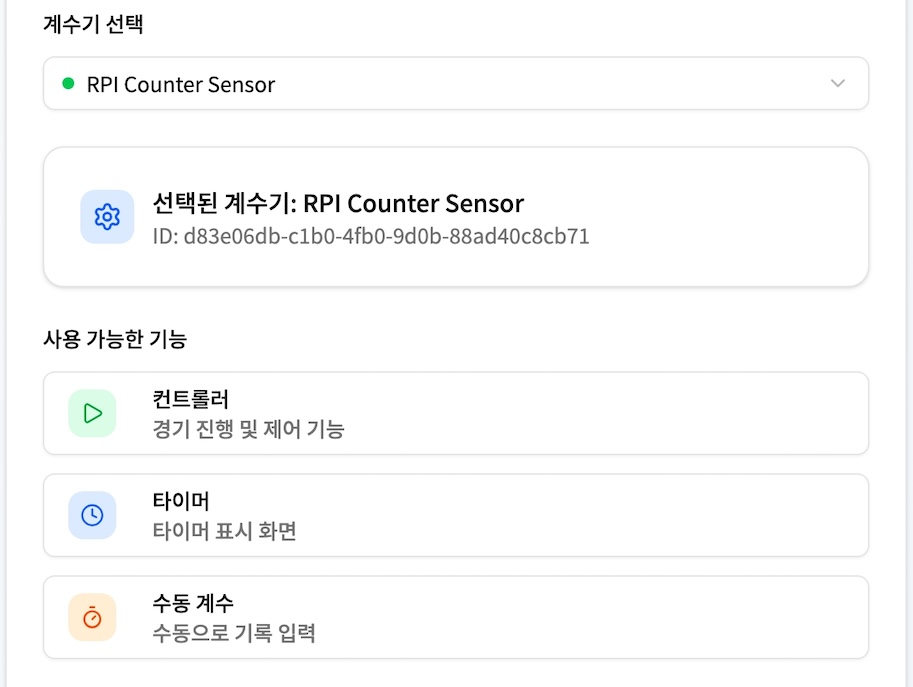
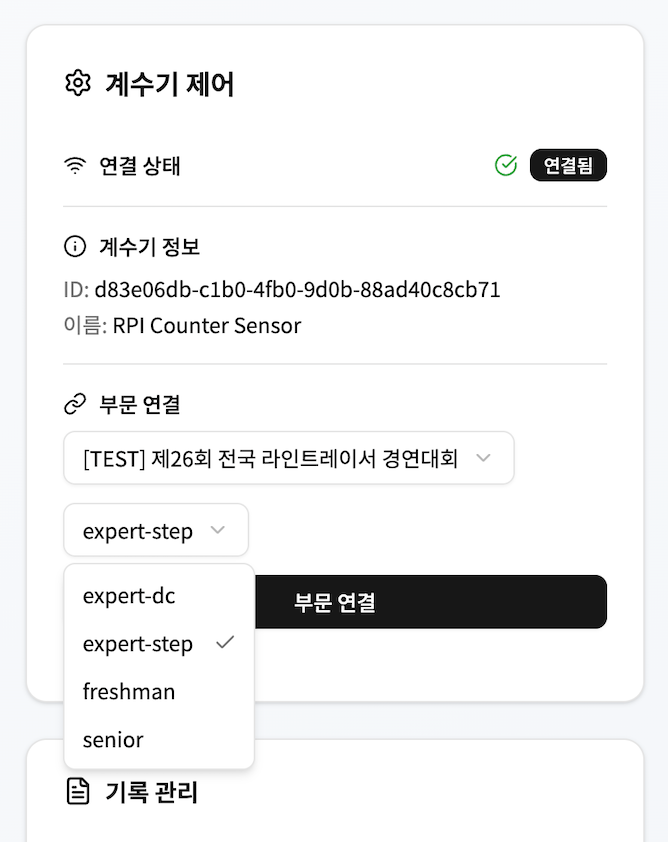
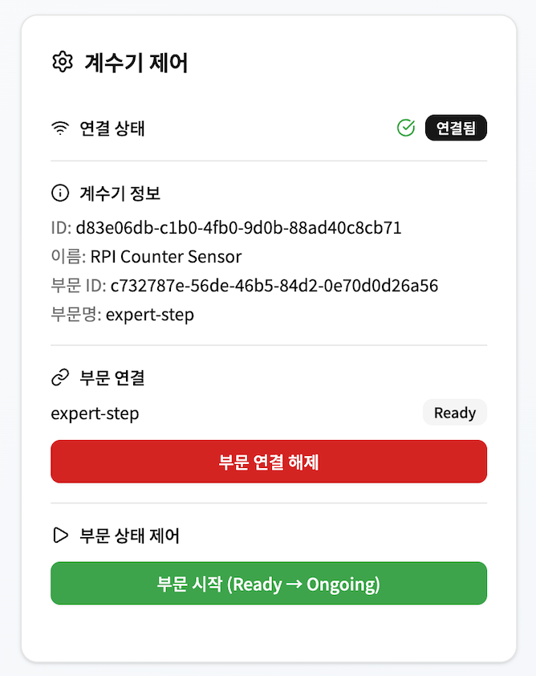
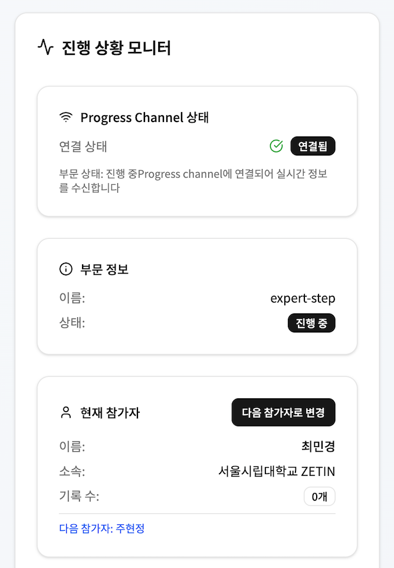
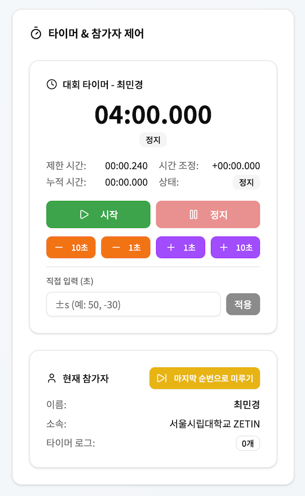
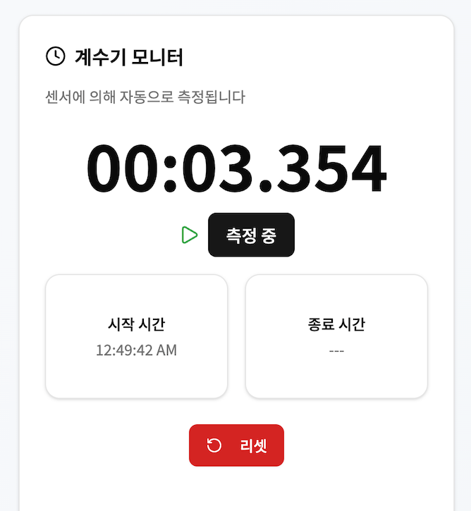
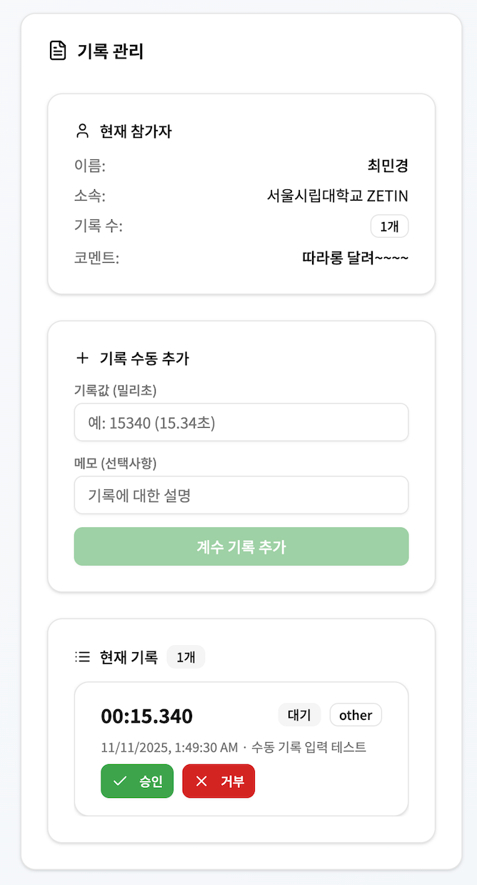
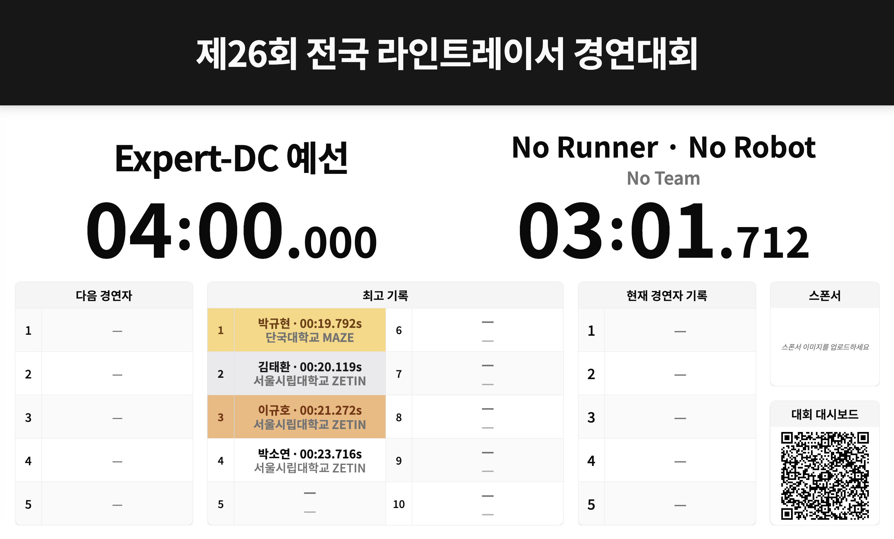
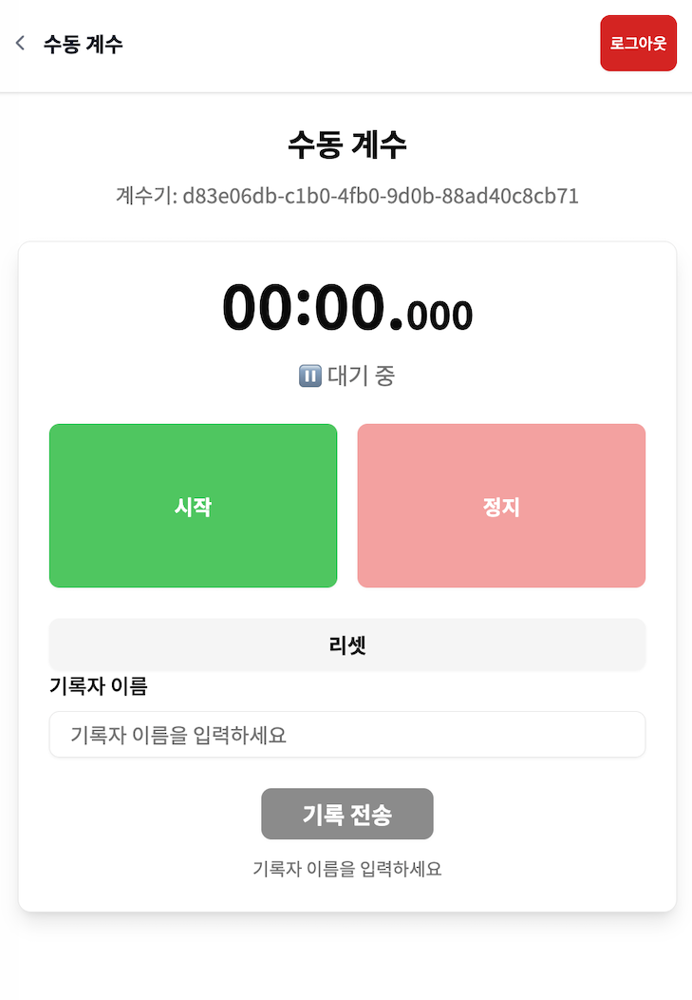
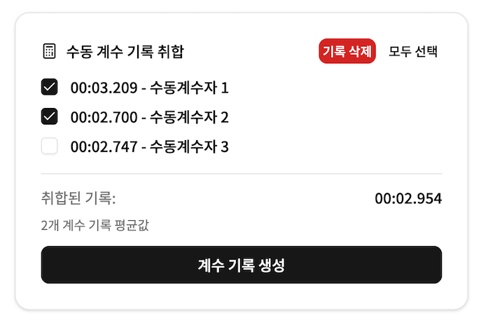

# 대회 진행/관리 훑어보기

[계수기 서비스](https://counter.zetin.uos.ac.kr)에 로그인한 후, '계수기 선택하기' 버튼을 눌러 연결된 계수기에 따라 아래의 기능들을 이용할 수 있습니다.

- 컨트롤러: 경기 진행 및 제어 기능
- 타이머: 타이머 표시 화면(이하 대시보드, 대형 스크린에 표시될 화면)
- 수동 계수: 수동 계수자가 볼 화면

## 컨트롤러

계수기에 특정 대회/부문을 설정할 수 있습니다. 처음 이 과정을 수행해야 참가자 목록 및 기록이 불러와지며, 실제 타이머 뷰(리더보드)에도 대회 이름 및 부문 정보가 표시됩니다.

연결된 대회/부문 정보를 확인하고, '부문 시작 (Ready -> Ongoing)' 버튼을 누르면 부문이 시작되어 경연자 정보가 불러와지고 기록을 측정하여 기입할 수 있는 상태가 됩니다.

현재 경연자 정보를 확인할 수 있으며, 경연이 끝났을 때 '다음 참가자로 변경' 버튼을 클릭하여 다음 경연자로 변경할 수 있습니다.

경연자가 주행판에 로봇을 내려 놓는 순간 부터 4분 타이머가 진행되어야 하기에 '시작' 버튼을 눌러 타이머를 진행시킵니다. 이떄, 심판의 판단 및 규정에 따라 타이머 시간을 삭감/추가할 수 있는 기능도 제공합니다. '마지막 순번으로 미루기' 버튼을 누르면 경연자의 순번이 맨 뒤로 밀립니다.

로봇이 계수기 H/W를 지나치면 알아서 스톱워치가 시작되고, 로봇이 도착하면 멈춥니다. 이때, 경연 부문이 설정되지 않아도 측정은 진행되며, 경연 부문 및 현재 경연자가 설정되어 있다면 측정이 끝났을 때 자동으로 기록이 등록됩니다. '리셋' 버튼을 누르면 관리자가 수동으로 계수기 시작/종료 기록을 초기화할 수 있습니다.

계수기 H/W로부터 출발/도착 이벤트를 받으면 알아서 시간이 기록되는데, 심판의 판단에 따라 이를 승인할 지 거절할 지 결정할 수 있습니다. '승인' 버튼을 누르면 해당 기록이 인정되며, 순위의 변동이 생길 수 있습니다. '거부' 버튼을 누르면 해당 기록이 인정되지 않으며, 기록은 남지만 최고 기록 취합에서는 제외됩니다.

## 타이머

타이머 화면에서는 컨트롤러에서 변화시킨 상태들이 정리되어 노출됩니다. 이 화면은 대형 스크린에 표시되어 관중들이 보게 될 화면입니다. 대회 대시보드 QR 코드를 찍어 접속하면 스마트폰으로 대회 현황을 확인할 수도 있습니다.

## 수동 계수

수동 계수자 계정으로 로그인하면 계수기에 따라 수동 계수 기능을 이용할 수 있는데, 시작/종료 버튼을 통해 로봇의 주행 시간을 수동 계수할 수 있습니다. 해당 시간은 본인(수동 계수자)의 이름을 입력하여 중앙 서버로 전송시킬 수 있으며, 컨트롤러 화면에서 해당 기록들을 취합하여 하나의 새로운 기록으로 만들 수 있습니다.

위의 화면은 컨트롤러 화면으로, 수동 계수된 주행 기록들이 보관되고, 관리자는 수동 계수 기록들을 선택하여 하나의 새로운 기록으로 만들 수 있습니다.