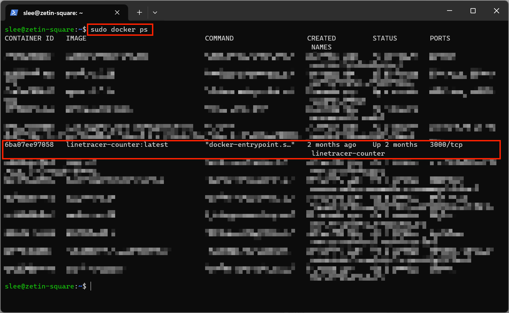
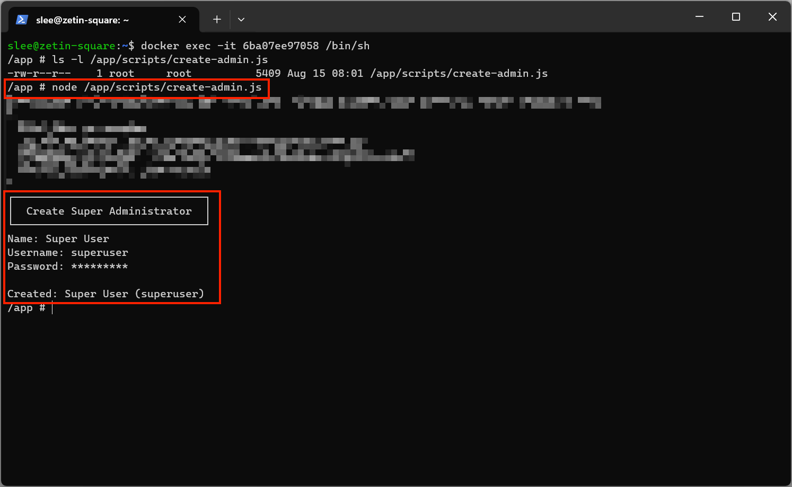

# 관리자 ID/PW를 까먹었어요

관리자 계정의 아이디나 비밀번호를 잊어버린 경우, 스크립트를 통해 새로운 관리자 계정을 생성할 수 있습니다.

## 관리자 계정 생성 스크립트

본 프로젝트는 관리자 계정 생성을 위한 전용 스크립트([server/scripts/create-admin.ts](../server/scripts/create-admin.ts))를 제공합니다. 이 스크립트는 다음과 같은 작업을 수행합니다.

- 대화형 인터페이스를 통해 관리자 이름, 아이디, 비밀번호를 입력받음
- 입력받은 정보로 새로운 사용자 계정을 생성함
- 생성된 계정에 관리자 권한(`administrator` 역할)을 부여함

이 스크립트를 사용하면 웹 인터페이스 없이도 안전하게 관리자 계정을 생성할 수 있습니다.

```bash
cd server
npm run script:create-admin
```

스크립트를 실행하면 이름, 아이디, 비밀번호를 차례로 입력하라는 안내가 나타납니다.

## 프로덕션 환경(ZETIN 서버)에서 실행하기

프로덕션 환경에서는 Docker 컨테이너 내부에서 스크립트를 실행해야 합니다.

1.  ZETIN 서버 접속

    - 먼저 SSH를 통해 ZETIN 서버에 접속합니다.

      ```bash
      ssh user@zetin-server-address
      ```

1.  컨테이너 찾기

    - 실행 중인 Docker 컨테이너 목록을 확인하여 linetracer-counter 서버 컨테이너 ID를 찾습니다.

      ```bash
      docker ps
      ```

      

    - 컨테이너 이름 또는 ID를 확인합니다. 일반적으로 `linetracer` 또는 `counter` 등의 키워드가 포함되어 있을 것입니다.

1.  컨테이너 내부 접속

    - 찾은 컨테이너에 접속합니다.

      ```bash
      docker exec -it {컨테이너_이름_또는_ID} /bin/sh
      ```

1.  관리자 계정 생성 스크립트 실행

    - 컨테이너 내부에서 스크립트를 실행합니다. 이미 빌드된 환경이므로 node를 이용하여 직접 실행합니다.

      ```bash
      node /app/scripts/create-admin.js
      ```

    - 이때, /app/ 이후 디렉터리는 환경마다 다를 수 있음에 주의합니다. 꼭 해당 스크립트가 있는지 찾고 확인한 뒤에 실행하길 바랍니다.

    - 스크립트가 실행되면 새로운 관리자 계정의 정보를 입력합니다.

      1. **Name**: 관리자 이름 (예: `Admin User`)
      1. **Username**: 로그인에 사용할 아이디
      1. **Password**: 비밀번호 (입력 시 `*`로 표시됨)

      

1.  확인 및 로그인

    - 스크립트가 정상적으로 완료되면 생성된 계정 정보가 출력됩니다. 이제 웹 인터페이스에서 새로 생성한 아이디와 비밀번호로 로그인할 수 있습니다.

## 주의사항

- 이 스크립트는 데이터베이스에 직접 접근하므로, 실행 전에 백업을 권장합니다.
- 생성된 관리자 계정은 모든 권한을 가지므로, 비밀번호를 안전하게 관리해야 합니다.
- 불필요한 관리자 계정은 웹 인터페이스에서 삭제하여 보안을 유지하세요.
