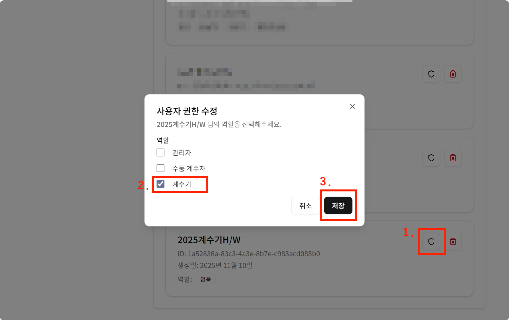
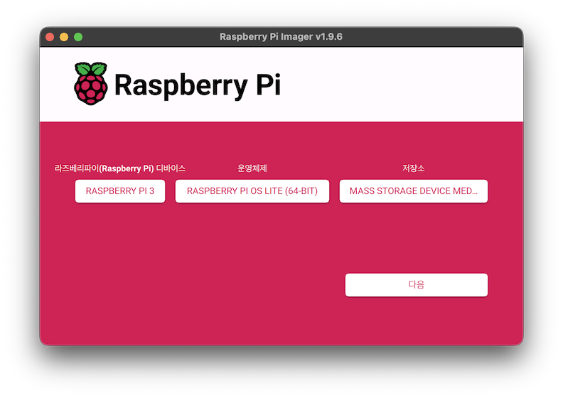
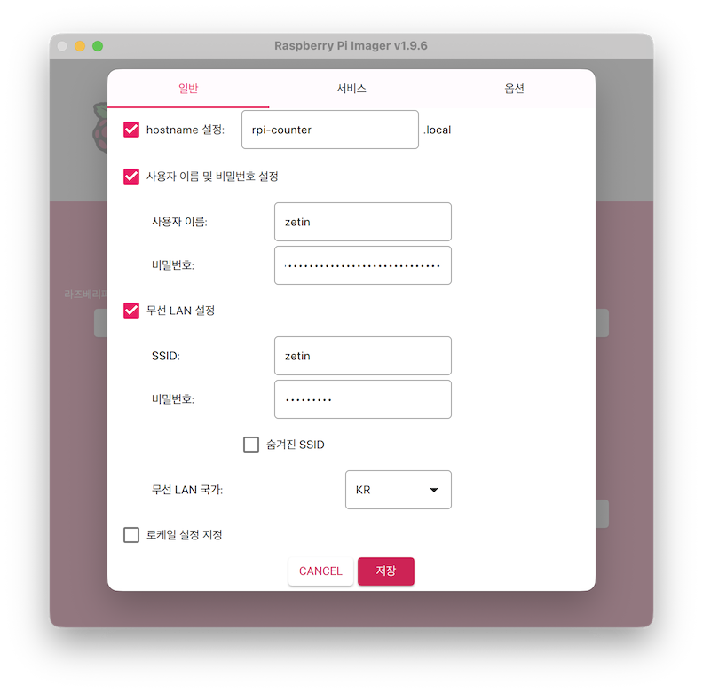
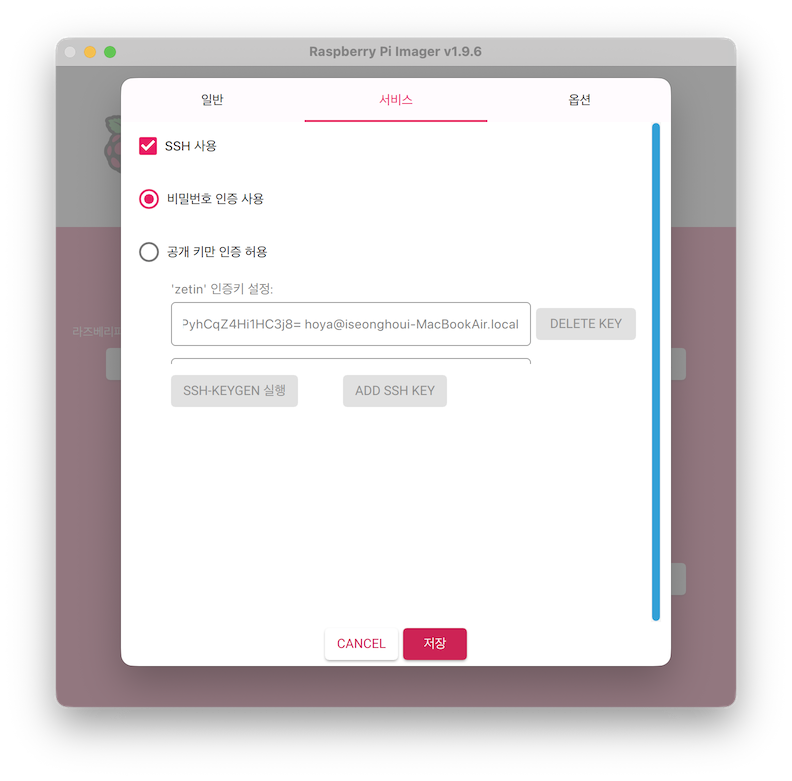
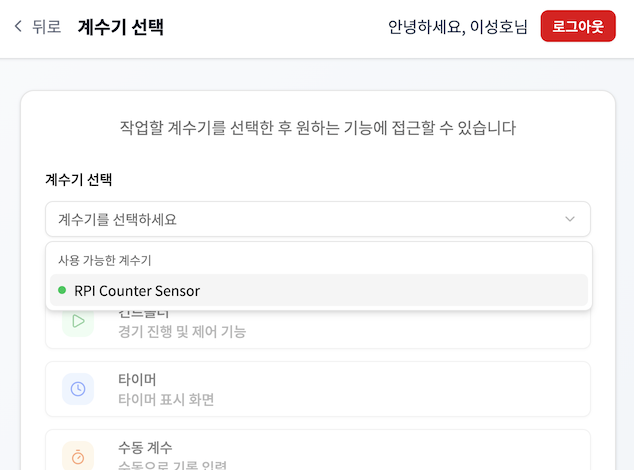

# 계수기 H/W 셋업하기

계수기 서비스를 제대로 이용하기 위해서는 계수기 H/W 셋업이 필요합니다. 기본적으로 계수기 H/W가 온라인 상태여야 다음의 기능들을 이용할 수 있습니다.

1. 컨트롤러 - 경기 진행 및 제어 기능
1. 타이머 - 타이머 표시 화면(이하 대시보드)
1. 수동 계수 - 수동으로 기록 입력

**이는 계수기 H/W에 하나의 대회 부문을 매핑하여 동작하도록 설계되었기 때문입니다.** 이 문서에서는 Raspberry Pi 기반 계수기 H/W를 셋업하는 과정을 설명하며, 다른 계수기 H/W 구현체와는 내용이 다를 수 있습니다. 계수기 H/W를 셋업하기 위해 다음의 단계를 수행해야 합니다.

1. 계수기 H/W용 계정 생성
1. Raspberry Pi 준비 및 접속
1. 컴파일 및 설치
1. 환경변수 설정
1. 서비스 구동

## 계수기 H/W용 계정 생성

익명의 계수기 H/W가 Backend 서버에 접근해서는 안되므로, 사전에 credential을 생성해야 합니다.

1. [계수기 서비스](https://counter.zetin.uos.ac.kr)에 로그인합니다.
1. '관리자 페이지 이동' 버튼을 누릅니다.
1. 왼쪽 사이드바에서 '사용자 관리' 메뉴에 들어갑니다.
1. '사용자 생성' 버튼을 누릅니다.
1. 다음을 참고하여 폼을 채운 후 '생성' 버튼을 누릅니다.
   - 이름: (예) 2025계수기H/W
   - 사용자명: ID에 해당하는 부분 - 추후 계수기 H/W 환경변수로 입력할 값
   - 비밀번호: PW에 해당하는 부분 - 추후 계수기 H/W 환경변수로 입력할 값
1. 생성된 사용자에 방패 모양 버튼을 눌러 권한을 수정하는데, '계수기'를 체크하여 저장합니다.
   

## Raspberry Pi 준비 및 접속

### Raspberry Pi OS 설치

- 준비물
   - Raspberry Pi 3B+
   - 5V 3A DC 어댑터
   - USB A to micro B 케이블
   - Micro SD Card(16GB 이상)
   - Micro SD Card 리더기
   - 센서 HAT

1. [여기](https://www.raspberrypi.com/software/)에서 Raspberry Pi Imager를 다운로드 및 설치한다.
1. 다음 이미지로 설정한다.
   - 라즈베파리이(Raspberry Pi) 디바이스: Raspberry Pi 3
   - 운영체제: **Raspberry Pi OS Lite (64-bit)**
      - Raspberry Pi OS (other)에 있음
   - 저장소: 기록할 SD 카드 선택
      <details>
      <summary>설정 사진</summary>
      
      </details>
1. 다음 버튼을 누르면 설정을 편집할 수 있는데, 아래와 같이 설정한다.
   - **hostname 설정**: rpi-counter
   - **사용자 이름 및 비밀번호 설정**: 적절한 값으로 설정
   - **무선 LAN 설정**: zetin Wi-Fi 정보 입력, 무선 LAN 국가 한국(KR)으로 꼭 설정
   - **SSH 사용 설정**
      <details>
      <summary>설정 사진</summary>
      
      
      </details>

1. SD Card를 Raspberry Pi에 장착하고 전원 켜기
1. **같은 네트워크**에서 SSH로 접속해보기
   ```bash
   # 노트북/PC에서
   ssh zetin@rpi-counter.local
   ```

### 패키지 업데이트

```bash
sudo apt update
sudo apt upgrade -y
```

### I2C 활성화

```bash
sudo raspi-config
```

위 명령어 입력 후 `3 Interface Options` > `I4 SPI` > `Would you like the SPI interface to be enabled? <Yes>` 메뉴를 통해 I2C 활성화합니다.

그 후에 재부팅합니다.
```bash
sudo reboot
```

재부팅 후에 다음 명령어로 해당 파일이 존재하는지 확인합니다.
```bash
ls -l /dev/spidev0.0
```

## 컴파일 및 설치

센서 데이터를 수집하여 Backend 서버로 보내는 H/W 클라이언트를 Raspberry Pi 환경에 맞게 컴파일하고 설치해야 합니다. 아래와 같이 진행할 수 있으나, 최신 내용은 [rpi-counter-sensor 디렉터리](../counters/rpi-counter-sensor/) 또는 [README.md](../counters/rpi-counter-sensor/README.md)을 참고해주세요.

```bash
# install requirements
sudo apt install -y cmake build-essential nlohmann-json3-dev libcurl4-openssl-dev git vim

# clone this project
git clone https://github.com/uos-zetin/linetracer-counter.git

# build & install
cd linetracer-counter/counters/rpi-counter-sensor/
mkdir build
cd build
cmake ..
make -j4
sudo make install
```

## 환경변수 설정

```bash
sudo vim /etc/rpi-counter-sensor/config.json
```
`/etc/rpi-counter-sensor/config.json` 파일을 아래와 같이 수정하여 주어진 환경에 맞게 설정을 진행해줍니다.

```json
{
  "device_id": "",
  "device_name": "RPI Counter Sensor",
  "sensor_start_threshold": 100,
  "sensor_end_threshold": 100,
  "sensor_end_debouncing_time": 200,
  "spi_device_path": "/dev/spidev0.0",
  "api_base_url": "https://counter.zetin.uos.ac.kr/api",
  "api_username": "gd-hong",
  "api_password": "super-secret",
  "api_http_timeout": 5
}
```

- `device_id`는 [Online UUID Generator](https://www.uuidgenerator.net/)에서 생성한 UUID를 사용합니다.
- `sensor_start_threshold`, `sensor_end_threshold`, `sensor_end_debouncing_time` 값은 실제로 계수기를 작동시켜보며 그 정도를 확인합니다.
- `api_username`, `api_password` 값은 앞에서 생성한 계수기 H/W용 계정을 사용합니다.

## 서비스 구동

```bash
# 재부팅 후에도 서비스 켜지게 설정
sudo systemctl enable rpi-counter-sensor.service
# 서비스 시작(재시작)
sudo systemctl restart rpi-counter-sensor.service
# 서비스 상태 확인하기
sudo systemctl status rpi-counter-sensor.service
```

그 후에 계수기 관리 페이지에서 계수기 이름이 나타나는지 확인합니다.

