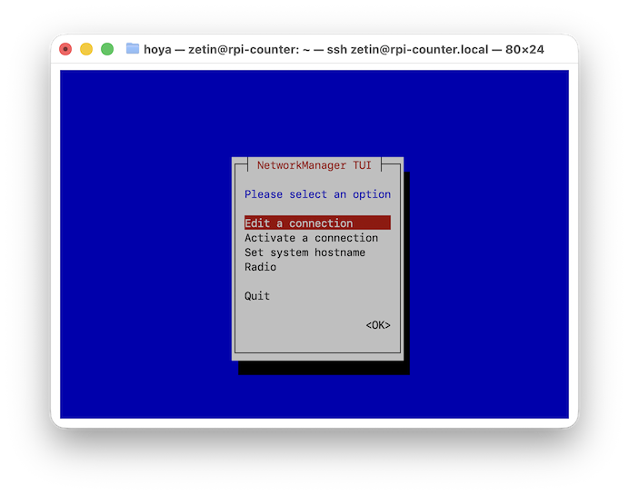
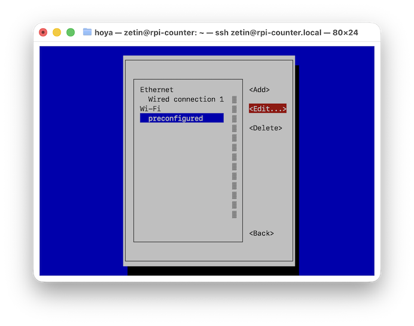
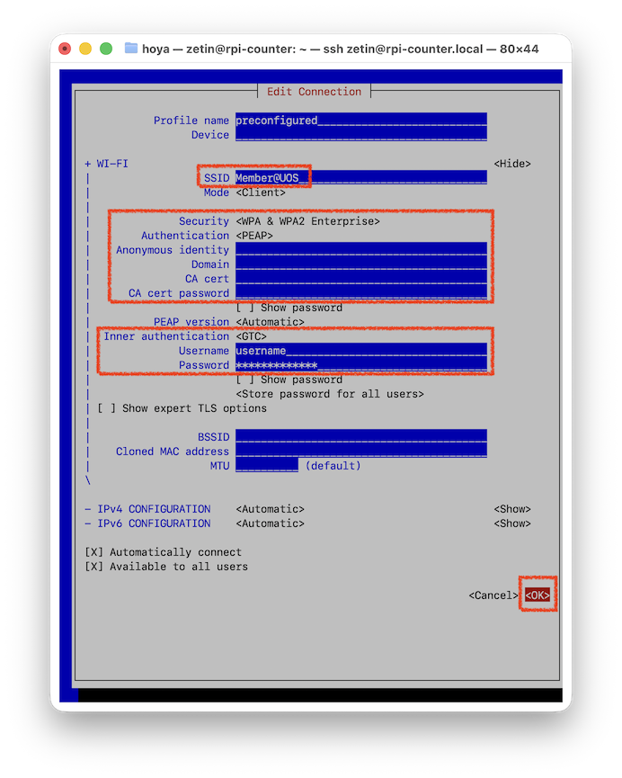
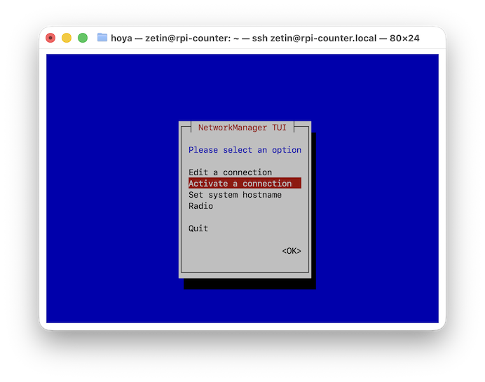
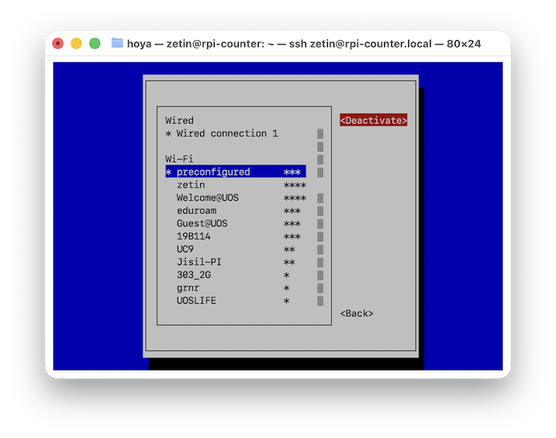
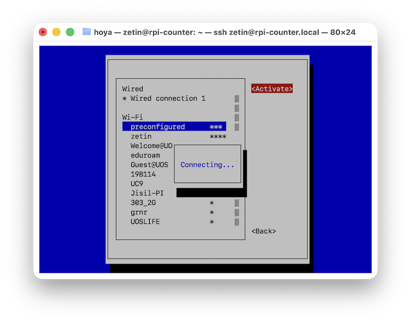

# 교내 Member@UOS 와이파이를 사용하고 싶어요

Raspberry Pi를 인터넷에 연결하려면 Wi-Fi 또는 Ethernet을 사용해야 합니다. Raspberry Pi OS를 설치할 때 Wi-Fi 설정을 SSID/Password로 진행한 경우, 해당 Wi-Fi 라우터를 항상 지니고 다녀야 한다는 단점이 있습니다. 하지만, 교내에서 구축된 Member@UOS Wi-Fi 인프라를 이용하면 교내 어디서든 계수기 H/W를 인터넷에 연결시킬 수 있습니다.

## 설정 방법

주의! 아래 명령어들은 꼭 유선 네트워트 환경 또는 외장 디스플레이를 연결한 후 진행하여야 합니다. Wi-Fi를 통해 접속한 환경에서는 환경 설정 변경으로 더 이상 접속이 불가할 수 있습니다.

### UOS WiFi 암호 설정하기
`대학행정 > 개인정보 > 대학행정환경설정 > 암호설정`에 들어가면 Member@UOS WiFi 암호를 설정할 수 있습니다.

### nmtui로 설정 변경하기

```bash
sudo nmtui
```

1. `Edit a connection` 메뉴에 들어갑니다(Enter).
    

1. `preconfigured`를 선택하고 `Edit...` 메뉴에 들어갑니다(Enter).
    

1. 아래대로 내용을 채워넣은 후 `OK`에 들어갑니다.
    

1. 뒤로 돌아간 후 원래 메뉴에서 `Activate a connection` 메뉴에 들어갑니다(Enter).
    

1. `preconfigured`를 선택하고 `Deactivate`한 뒤 다시 `Activate`를 수행합니다.
    
    

1. ESC 키를 연타하여 nmtui에서 빠져나옵니다.

## 연결 확인하기

다음 명령어로 네트워크 연결 상태를 확인합니다.

```bash
iwconfig wlan0
```

정상적으로 연결되었다면 `ESSID:"Member@UOS"`가 표시됩니다.

인터넷 연결을 확인하려면 아래의 명령어를 이용합니다.

```bash
ping -c 4 google.com
```
