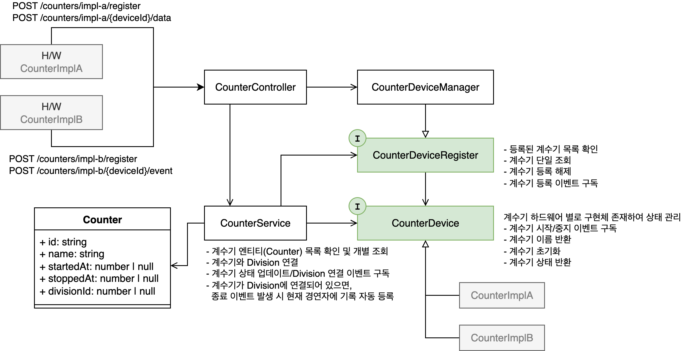

# Counter Architecture

## 개요

이 문서는 계수기 H/W와 서버가 서로 연결되는 아키텍처에 대해 설명한다. 다양한 하드웨어 계수기를 통합 관리하고, HTTP API를 통해 웹 클라이언트에서 접근할 수 있도록 설계되었다.

<picture>
  <source media="(prefers-color-scheme: dark)" srcset="./assets/counter-architecture-diagram-dark.png">
  <source media="(prefers-color-scheme: light)" srcset="./assets/counter-architecture-diagram-light.png">
  
</picture>

## 아키텍처 구성요소

### Core 레이어

#### [Counter 엔티티](../src/core/models.ts)

- 계수기 상태를 나타내는 엔티티

```typescript
export interface Counter {
  id: string; // 계수기 ID
  name: string; // 계수기 이름
  startedAt: number | null; // 시작 시각(unix timestamp, null이면 아직 시작되지 않음을 의미함)
  stoppedAt: number | null; // 종료 시각(unix timestamp, null이면 아직 종료되지 않음을 의미함)
  divisionId: string | null; // 대회 부문 ID (null이면 아직 대회 부문에 연결되지 않음을 의미함)
}
```

#### [CounterDevice 인터페이스](../src/core/interfaces.ts)

- 모든 계수기 하드웨어의 추상화 인터페이스
- 계수기 디바이스별 구현체가 반드시 준수해야 하는 계약 정의
- 이벤트 기반 상태 변경 알림 (`start`, `stop`, `reset`)

#### [CounterDeviceRegistry 인터페이스](../src/core/interfaces.ts)

- 등록된 계수기 디바이스들의 목록 관리
- 서비스 레이어가 구현체를 알 필요 없이 계수기에 접근할 수 있도록 추상화
  - 등록된 계수기 디바이스 인스턴스들을 조회, 등록 해제, 이벤트 구독 기능만 제공
  - 계수기 디바이스 등록은 구현체별로 다르므로 인터페이스에서 제외
  - 인터페이스에 모든 계수기 구현체에 대한 메서드를 정의하는 것은 코어 레이어의 변경을 유발할 수 있으므로 인터페이스에서 제외
- 서비스 레이어는 이 인터페이스를 통해 등록된 계수기 디바이스에 접근할 수 있다.
- 실제 구현체에서는 계수기 디바이스를 등록하고 데이터를 받아 처리하는 로직을 구현한다.

### Infrastructure 레이어

#### [CounterDeviceManager](../src/infrastructure/counters/counter-device-manager.ts)

- `CounterDeviceRegistry` 인터페이스의 구현체
- 다양한 계수기 하드웨어 구현체들을 통합 관리
  - **계수기마다 등록하는 방식, 어떤 데이터들이 필요한지 모두 다르기 때문에 해당 매니저 클래스에 구현하도록 한다.**
- 계수기별 이벤트 중계 및 생명주기 관리

#### [FrontBackIrCounterDevice](../src/infrastructure/counters/front-back-ir-counter-device.ts)

- `CounterDevice` 인터페이스의 구현체
- 앞뒤 IR 센서를 사용하는 계수기의 구체적인 구현
- 센서 데이터 기반 상태 머신 관리
- 디바운싱을 통한 안정적인 출발/도착 감지
- 이 클래스의 인스턴스화는 `CounterDeviceManager`에서 이루어진다.

### Service 레이어

#### [CounterService](../src/core/services/counter.ts)

- 계수기와 대회 부문(Division) 간의 바인딩 관리
- 계수기 이벤트 발생 시 현재 경연자에게 자동 기록 등록
- HTTP 컨트롤러와 계수기 디바이스 사이의 비즈니스 로직 처리

### Presentation 레이어

#### [CounterController](../src/http/controllers/counter.controller.ts)

- HTTP API 엔드포인트 제공
- 웹 클라이언트의 계수기 관련 요청 처리

#### [CounterGateway](../src/http/gateway/counter.gateway.ts)

- 계수기 이벤트를 웹 소켓을 통해 실시간 이벤트 스트리밍
  - `event`: 계수기 이벤트 구독
  - `message`: 계수기에서 이벤트가 발생하는 시점에 `Counter` 엔티티 전송
  - `error`: 계수기 이벤트 처리 중 에러 발생 시 에러 전송

## 새로운 CounterDevice 구현체 개발 가이드

### 1. CounterDevice 인터페이스 구현

새로운 계수기 하드웨어를 추가할 때는 반드시 `CounterDevice` 인터페이스를 구현해야 합니다.

```typescript
export class MyCustomCounterDevice implements CounterDevice {
  readonly deviceId: string;
  readonly name: string;

  private eventEmitter: EventEmitter = new EventEmitter();

  constructor(deviceId: string, name: string /* 추가 설정값들 */) {
    this.deviceId = deviceId;
    this.name = name;
    // 초기화 로직
  }

  public subscribe(
    callback: (event: CounterDeviceEvent) => Promise<void>
  ): Unsubscriber {
    // 이벤트 구독 로직 구현
    // 에러 핸들링을 위한 try-catch 래핑 필요
  }

  public async getStatus(): Promise<CounterDeviceStatus> {
    // 현재 상태 반환 (startedAt, stoppedAt)
  }

  public async reset(): Promise<void> {
    // 디바이스 상태 초기화
    // reset 이벤트 발생 필요
  }
}
```

### 2. 고려사항

#### 2.1 상태 관리

- **불변성 원칙**: `deviceId`와 `name`은 readonly로 선언하여 생성 후 변경 불가
- **상태 일관성**: `getStatus()`와 실제 내부 상태가 항상 일치하도록 보장

#### 2.2 이벤트 처리

- **에러 격리**: 콜백 함수에서 발생하는 예외가 디바이스 동작을 중단시키지 않도록 try-catch 처리
- **이벤트 순서**: 이벤트가 발생한 시간 순서대로 처리되도록 보장
- **메모리 누수 방지**: `Unsubscriber` 함수를 통해 이벤트 리스너가 적절히 해제되도록 구현

#### 2.3 하드웨어 인터페이스

- **데이터 검증**: 하드웨어에서 전달받은 데이터의 유효성을 반드시 검증
- **상태 관리**: 하드웨어와 상태가 일치하도록 보장하여야 함

### 3. CounterDeviceManager 확장

새로운 구현체를 추가했다면 `CounterDeviceManager`에 해당 디바이스를 등록하고 관리할 수 있는 메서드들을 추가해야 합니다.

```typescript
// CounterDeviceManager에 추가할 메서드 예시
public registerMyCustomCounter(
  name: string,
  deviceId: string,
  customConfig: MyCustomConfig
): MyCustomCounterDevice {
  const counter = new MyCustomCounterDevice(deviceId, name, customConfig);

  this.registerCounterVariant(deviceId, {
    type: "my-custom",
    value: counter,
    unsubscribe: counter.subscribe(async (event) => {
      this.eventEmitter.emit(deviceId, event);
    }),
  });

  return counter;
}

public pushMyCustomCounterData(
  deviceId: string,
  data: MyCustomDataFormat[]
) {
  const counterVariant = this.getCounterVariant(deviceId);
  if (counterVariant.type !== "my-custom") {
    throw new CounterNotRegisteredError(
      `My custom counter not registered for deviceId: ${deviceId}`
    );
  }

  // 데이터를 구현체에 전달하는 로직
}
```

### 4. 외부 연결 설정

- HTTP, WebSocket, TCP 등 다양한 프로토콜 연결 방식을 지원할 수 있도록 설계되었다.
- 데이터 주입 메서드는 `CounterDeviceManager`에서 구현하고, 이를 다양한 구현체에서 사용하도록 한다.
- 예를 들어, HTTP Controller에서 데이터를 받아 `CounterDeviceManager`에 전달하고, `CounterDeviceManager`는 이를 다양한 구현체에 전달하여 처리하도록 한다.
- TCP 연결 방식은 새로운 Worker 프로세스를 생성하여 전달할 수도 있다.
